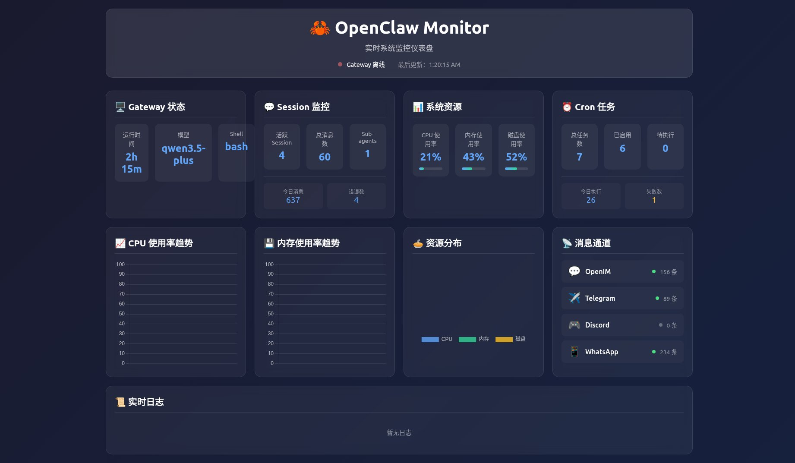

# 🦀 OpenClaw Monitor

> 实时系统监控仪表盘 - 跨平台桌面应用



## ✨ 功能特性

### 🖥️ Gateway 监控
- 实时运行状态
- 正常运行时间
- 模型信息
- Shell 环境

### 💬 Session 监控
- 活跃 Session 数量
- 消息统计（今日/总计）
- Sub-agents 状态
- 错误计数

### 📊 系统资源
- **CPU 使用率** - 实时折线图
- **内存使用率** - 实时折线图
- **磁盘使用率** - 饼图分布
- 进度条可视化（绿→黄→红）

### ⏰ Cron 任务
- 任务总数/启用数
- 待执行任务
- 今日执行统计
- 失败计数

### 📡 消息通道
- OpenIM 状态
- Telegram 状态
- Discord 状态
- WhatsApp 状态
- 实时消息计数

### 🚨 智能告警
- CPU > 80% 警告，> 90% 严重
- 内存 > 80% 警告，> 90% 严重
- 磁盘 > 75% 警告，> 85% 严重
- 视觉告警（闪烁横幅）
- 可手动关闭告警

### 📜 实时日志
- 系统事件流
- 错误日志
- 警告信息
- 时间戳记录

---

## 🛠️ 技术栈

- **前端**: Vue 3 + Vite + Chart.js
- **后端**: Rust + Tauri
- **样式**: 自定义 CSS（深色主题 + 毛玻璃效果）
- **图表**: Chart.js（折线图、饼图）

---

## 🚀 快速开始

### 环境要求

- Node.js >= 16
- Rust >= 1.75
- 系统依赖（见 [BUILD.md](BUILD.md)）

### 安装依赖

```bash
npm install
```

### 开发模式

```bash
npm run tauri dev
```

### 生产构建

```bash
npm run tauri build
```

构建产物位于 `src-tauri/target/release/bundle/`

---

## 📁 项目结构

```
openclaw-monitor/
├── src/                    # Vue 前端代码
│   ├── components/         # 组件
│   ├── App.vue            # 主应用组件
│   └── main.js            # 入口文件
├── src-tauri/              # Rust 后端
│   ├── src/
│   │   └── main.rs        # Tauri 主程序 + API
│   ├── Cargo.toml         # Rust 依赖配置
│   ├── tauri.conf.json    # Tauri 配置
│   └── build.rs           # 构建脚本
├── index.html              # HTML 入口
├── package.json            # npm 配置
├── vite.config.js          # Vite 配置
├── plan.md                 # 开发计划
├── BUILD.md                # 构建指南
└── README.md               # 本文件
```

---

## 📊 监控指标说明

### Gateway 状态
通过 `openclaw status` 命令获取

### Session 统计
通过 `sessions_list` API 获取

### 系统资源
- CPU: `top` 命令解析
- 内存：`free -m` 命令解析
- 磁盘：`df /` 命令解析

### Cron 任务
通过 `openclaw cron list` 命令获取

### 消息通道
通过 `message` 工具状态获取

---

## ⚙️ 配置

### 告警阈值

在 `src/App.vue` 中修改 `checkAlerts` 函数：

```javascript
const checkAlerts = (cpu, memory, disk) => {
  // CPU 告警
  if (cpu > 90) { /* 严重 */ }
  if (cpu > 80) { /* 警告 */ }
  
  // 内存告警
  if (memory > 90) { /* 严重 */ }
  if (memory > 80) { /* 警告 */ }
  
  // 磁盘告警
  if (disk > 85) { /* 严重 */ }
  if (disk > 75) { /* 警告 */ }
}
```

### 刷新频率

默认每 3 秒刷新一次，在 `fetchData` 的 `setInterval` 中修改：

```javascript
refreshInterval = setInterval(fetchData, 3000) // 3000ms = 3 秒
```

### 图表数据点数量

默认保留最近 30 个数据点（约 90 秒历史），在 `updateCharts` 中修改：

```javascript
if (timeLabels.value.length > 30) {
  // 调整这个数字
}
```

---

## 📸 截图


---

## 🤝 贡献

欢迎提交 Issue 和 Pull Request！

---

## 📄 许可证

MIT License

---

## 🙏 致谢

- [Tauri](https://tauri.app/) - 跨平台桌面应用框架
- [Vue 3](https://vuejs.org/) - 渐进式 JavaScript 框架
- [Chart.js](https://www.chartjs.org/) - 简洁的图表库
- [OpenClaw](https://openclaw.ai/) - AI Agent 框架

---

*最后更新：2026-03-17*
